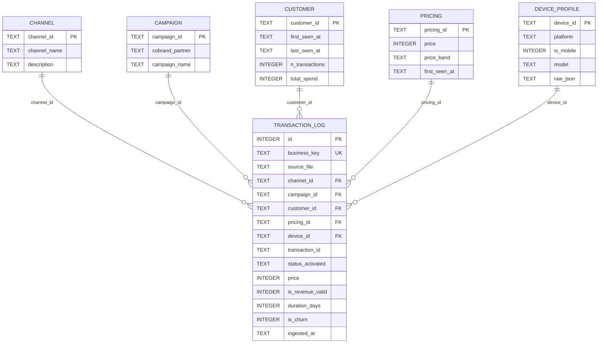

# ERD Relational Basis Data Norton

```mermaid
erDiagram
    CHANNEL ||--o{ TRANSACTION_LOG : "channel_id"
    CAMPAIGN ||--o{ TRANSACTION_LOG : "campaign_id"
    CUSTOMER ||--o{ TRANSACTION_LOG : "customer_id"
    PRICING ||--o{ TRANSACTION_LOG : "pricing_id"
    DEVICE_PROFILE ||--o{ TRANSACTION_LOG : "device_id"

    CHANNEL {
        TEXT channel_id PK
        TEXT channel_name
        TEXT description
    }

    CAMPAIGN {
        TEXT campaign_id PK
        TEXT cobrand_partner
        TEXT campaign_name
    }

    CUSTOMER {
        TEXT customer_id PK
        TEXT first_seen_at
        TEXT last_seen_at
        INTEGER n_transactions
        INTEGER total_spend
    }

    PRICING {
        TEXT pricing_id PK
        INTEGER price
        TEXT price_band
        TEXT first_seen_at
    }

    DEVICE_PROFILE {
        TEXT device_id PK
        TEXT platform
        INTEGER is_mobile
        TEXT model
        TEXT raw_json
    }

    TRANSACTION_LOG {
        INTEGER id PK
        TEXT business_key UK
        TEXT source_file
        TEXT channel_id FK
        TEXT campaign_id FK
        TEXT customer_id FK
        TEXT pricing_id FK
        TEXT device_id FK
        TEXT transaction_id
        TEXT status_activated
        INTEGER price
        INTEGER is_revenue_valid
        INTEGER duration_days
        INTEGER is_churn
        TEXT ingested_at
    }
```

Gambar ERD Relational Basis Data Norton
